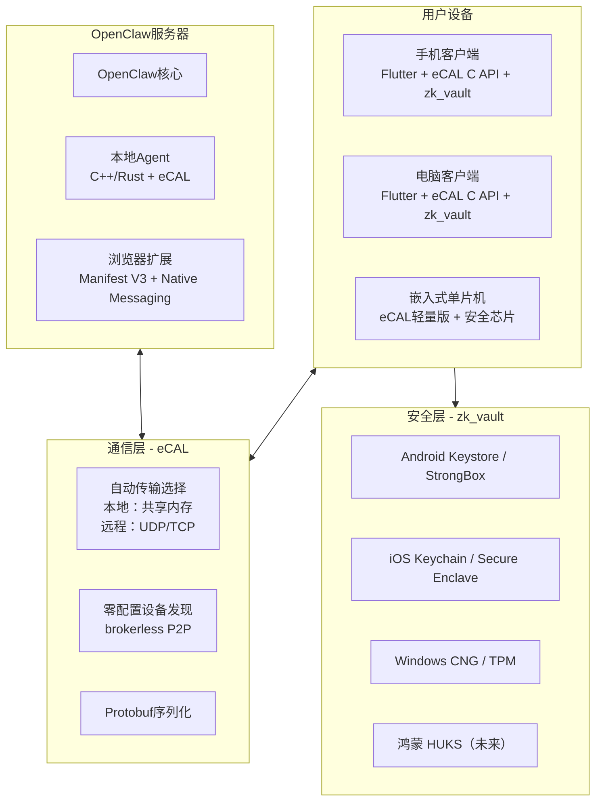
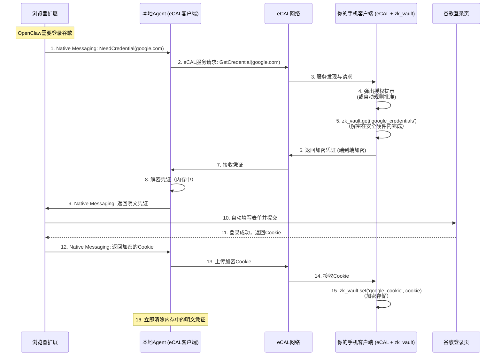

# OpenClaw远程授信客户端完整方案：eCAL + zk_vault

基于我们之前关于鸿蒙设计理念、远程授信、跨平台实现以及嵌入式支持的深入讨论，现在为您整合出一套**完整、可操作的实现方案**。本方案以**eCAL为通信核心**、**zk_vault为安全基石**，完全遵循鸿蒙的分布式、硬件隔离、能力虚拟化设计理念，同时确保代码可运行在当前主流平台（安卓/iOS/Windows/macOS/Linux）上，并为未来鸿蒙生态的深度集成做好准备。

---

## 1. 方案概述与核心理念

### 1.1 方案目标
- **远程授信**：OpenClaw服务器需要登录第三方服务时，实时向用户客户端请求凭证，服务器端**不存储任何明文敏感信息**。
- **硬件级安全**：所有凭证在客户端由安全硬件（TEE/Secure Enclave/TPM）保护，应用只能调用不能读取。
- **去中心化通信**：客户端与OpenClaw之间通过eCAL的P2P加密通道直接通信，无需中心服务器。
- **跨平台覆盖**：同时支持手机（iOS/Android）、电脑（Windows/macOS/Linux）、嵌入式设备。
- **鸿蒙优先**：底层架构借鉴鸿蒙的分布式软总线、HUKS设计，在鸿蒙设备上深度集成系统能力。

### 1.2 核心理念与鸿蒙设计的对应关系

| 鸿蒙设计理念 | 本方案实现 | 技术选型 |
|------------|-----------|---------|
| **分布式软总线** | 统一通信抽象层，自动选择最优传输路径 | **eCAL**（共享内存/UDP/TCP自动切换） |
| **HUKS硬件安全** | 硬件级密钥存储与操作，密钥永不离开安全环境 | **zk_vault** + 各平台原生Keystore  |
| **能力虚拟化** | 设备间互相暴露服务（凭证存储、传感器数据等） | Protobuf定义服务 + eCAL服务接口 |
| **分布式数据** | 凭证跨设备同步，离线优先 | CouchDB/PouchDB（可选） |

---

## 2. 整体架构



---

## 3. 核心组件详解

### 3.1 通信层：eCAL（enhanced Communication Abstraction Layer）

eCAL是一个由Continental开源的高性能通信中间件，专为分布式系统设计。它完美契合鸿蒙软总线的设计理念：

#### 3.1.1 eCAL的核心特性

| 特性 | 说明 | 与需求的契合点 |
|------|------|---------------|
| **自动传输选择** | 本地通信自动用共享内存（1-20 GB/s），网络通信自动用UDP/TCP  | 设备在同一局域网用共享内存超低延迟，跨公网自动切换TCP |
| **brokerless架构** | 无中心节点，设备间直接P2P通信  | 完全去中心化，符合您的设计理念 |
| **跨平台支持** | Windows/Linux（稳定）、macOS/FreeBSD（实验）、支持ARM  | 覆盖所有目标平台 |
| **多语言绑定** | C++/C核心，支持Python、C#、Rust、Go等  | Flutter可通过C API调用，嵌入式可用C/C++ |
| **零配置发现** | 设备自动发现，无需手动配置  | 用户体验极佳 |
| **协议无关** | 支持Protobuf、Cap'n Proto、FlatBuffers等  | 我们用Protobuf定义通信协议 |

#### 3.1.2 eCAL的通信模式
eCAL支持两种核心模式，可满足远程授信的所有需求：
- **发布-订阅（Publish-Subscribe）**：用于消息广播，如OpenClaw发布"需要凭证"事件。
- **服务-客户端（Service-Client）**：用于请求-响应交互，如客户端向OpenClaw提供凭证。

#### 3.1.3 为什么选择eCAL？
与ZeroMQ、MQTT等相比，eCAL的最大优势在于**自动传输选择**和**零配置发现**——这正是鸿蒙软总线的精髓。您不需要手动判断设备在局域网还是公网，eCAL会自动处理。

### 3.2 安全层：zk_vault

zk_vault是一个专为Flutter设计的零知识安全存储库，深度集成各平台硬件安全模块。

#### 3.2.1 zk_vault的核心特性

| 特性 | 说明 |
|------|------|
| **AES-256-GCM加密** | 所有数据使用行业标准加密算法  |
| **硬件KMS集成** | Android Keystore + StrongBox、iOS Secure Enclave  |
| **生物认证** | 可选指纹/面容ID解锁  |
| **内存安全** | 密钥锁定后立即从内存清零  |
| **原子操作** | 所有存储操作保证完整性  |

#### 3.2.2 平台支持详情

| 平台 | 安全机制 | 最低版本 | 硬件回退 |
|------|---------|---------|---------|
| **Android** | Keystore + StrongBox（API 28+） | API 21 | 软件加密  |
| **iOS** | Secure Enclave + Keychain | iOS 11+ | 软件加密  |
| **Windows** | CNG + TPM（通过`keytar`） | - | 软件加密 |
| **macOS** | Keychain + Secure Enclave | - | 软件加密 |
| **Linux** | libsecret（可配合TPM） | - | 软件加密 |
| **鸿蒙** | HUKS（通过自定义适配） | - | TEE/安全芯片 |

#### 3.2.3 为什么选择zk_vault？
zk_vault完美实现了您反复强调的"**秘钥只能调用不能读取**"——密钥在安全硬件内生成和存储，应用通过API调用签名/加密操作，**密钥材料永不返回应用层**。这正是鸿蒙HUKS的设计理念在跨平台上的实现。

---

## 4. 远程授信核心流程（完整时序）



---

## 5. 详细实现方案

### 5.1 通信协议定义（Protobuf）

```protobuf
// openclaw.proto
syntax = "proto3";

package openclaw;

// 凭证请求
message CredentialRequest {
    string service_url = 1;      // 例如 "https://accounts.google.com"
    string session_id = 2;        // 会话标识
    uint64 timestamp = 3;
}

// 凭证响应
message CredentialResponse {
    string session_id = 1;
    bytes encrypted_credential = 2;  // 由客户端公钥加密的凭证
    bool success = 3;
    string error_message = 4;
}

// Cookie上传
message CookieUpload {
    string service_url = 1;
    bytes encrypted_cookie = 2;   // 由客户端公钥加密
    string session_id = 3;
}

// 设备能力声明（用于能力虚拟化）
message Capability {
    string device_id = 1;
    repeated string services = 2;  // 例如 "credential_provider", "sensor_data"
    map<string, string> metadata = 3;
}
```

### 5.2 客户端实现（Flutter + zk_vault）

#### 5.2.1 安全存储封装

```dart
// lib/services/secure_storage.dart
import 'package:zk_vault/zk_vault.dart';

class SecureStorageService {
  late ZKVault _vault;

  Future<void> init() async {
    // 使用硬件KMS，可选生物认证
    final kms = NativePlatformKMS();
    _vault = await ZKVault.open(
      'openclaw_vault',
      requireBiometric: true,  // 可选
      kms: kms,
    );

    // 检查硬件支持情况
    print('硬件安全: ${await kms.isHardwareBacked()}');
  }

  // 存储凭证（加密）
  Future<void> saveCredential(String service, String username, String password) async {
    final credential = {
      'username': username,
      'password': password,
      'updated_at': DateTime.now().toIso8601String(),
    };

    final jsonString = jsonEncode(credential);
    await _vault.set(
      'credential_$service', 
      Uint8List.fromList(utf8.encode(jsonString))
    );
  }

  // 读取凭证（解密）
  Future<Map<String, String>?> getCredential(String service) async {
    final data = await _vault.get('credential_$service');
    if (data == null) return null;

    final jsonString = utf8.decode(data);
    return jsonDecode(jsonString) as Map<String, String>;
  }

  // 安全擦除
  Future<void> clearAll() async {
    await _vault.destroy();
  }
}
```

#### 5.2.2 eCAL通信封装

```dart
// lib/services/ecal_service.dart
import 'dart:ffi';
import 'package:ffi/ffi.dart';

// 通过Dart FFI调用eCAL C API
class ECALService {
  late DynamicLibrary _ecalLib;

  Future<void> init() async {
    // 加载eCAL动态库
    if (Platform.isAndroid) {
      _ecalLib = DynamicLibrary.open('libecal_core.so');
    } else if (Platform.isWindows) {
      _ecalLib = DynamicLibrary.open('ecal_core.dll');
    } else {
      _ecalLib = DynamicLibrary.process();
    }

    // 调用eCAL::Initialize
    final initialize = _ecalLib.lookupFunction<Void Function(Int32, Pointer<Pointer<Char>>, Pointer<Char>), 
                                                  void Function(int, Pointer<Pointer<Char>>, Pointer<Char>)>('ecal_initialize');
    initialize(0, nullptr, "OpenClaw Client".toNativeUtf8());
  }

  // 创建服务端（提供凭证）
  void startCredentialService() {
    // 创建服务，响应CredentialRequest
    // 实现略（需要绑定eCAL C API的回调）
  }

  // 发送凭证响应
  void sendCredentialResponse(String sessionId, Uint8List encryptedCredential) {
    // 实现略
  }
}
```

#### 5.2.3 授权界面

```dart
// lib/screens/auth_request.dart
class AuthRequestScreen extends StatelessWidget {
  final String serviceUrl;
  final String sessionId;

  @override
  Widget build(BuildContext context) {
    return AlertDialog(
      title: Text('授权请求'),
      content: Text('OpenClaw 请求登录: $serviceUrl'),
      actions: [
        TextButton(
          onPressed: () => _deny(context),
          child: Text('拒绝'),
        ),
        ElevatedButton(
          onPressed: () => _approve(context),
          child: Text('允许'),
        ),
      ],
    );
  }

  Future<void> _approve(BuildContext context) async {
    // 从zk_vault读取凭证
    final storage = SecureStorageService();
    final cred = await storage.getCredential(serviceUrl);

    if (cred != null) {
      // 通过eCAL返回
      final ecal = ECALService();
      final encrypted = _encryptForOpenClaw(cred);
      ecal.sendCredentialResponse(sessionId, encrypted);
    }
  }
}
```

### 5.3 OpenClaw本地Agent实现（C++）

```cpp
// agent/agent.cpp
#include <ecal/ecal.h>
#include <ecal/msg/protobuf/client.h>
#include <iostream>
#include <string>
#include "openclaw.pb.h"

// Native Messaging协议：4字节长度 + JSON
void handleNativeMessage(const std::string& input) {
    // 解析来自浏览器扩展的消息
    auto request = parseJson(input);

    if (request["type"] == "need_credential") {
        // 通过eCAL向客户端请求凭证
        eCAL::protobuf::CClient<openclaw::CredentialRequest, 
                                 openclaw::CredentialResponse> client("credential_service");

        openclaw::CredentialRequest req;
        req.set_service_url(request["url"]);
        req.set_session_id(request["session_id"]);
        req.set_timestamp(time(nullptr));

        // 发送请求，等待响应
        openclaw::CredentialResponse resp;
        if (client.Call(req, resp)) {
            // 解密凭证（使用Agent的私钥）
            std::string credential = decrypt(resp.encrypted_credential());

            // 通过Native Messaging返回给扩展
            sendNativeMessage(credential);
        }
    }
}

int main() {
    // 初始化eCAL
    eCAL::Initialize(0, nullptr, "OpenClaw Agent");

    // 等待客户端连接
    while (eCAL::Ok()) {
        // 处理Native Messaging输入
        std::string input;
        std::cin.read(input.data(), 4); // 读取长度
        // ... 读取完整消息
        handleNativeMessage(input);
    }

    eCAL::Finalize();
    return 0;
}
```

### 5.4 浏览器扩展（Manifest V3）

```javascript
// extension/background.js
let nativePort = null;

// 连接本地Agent
function connectToAgent() {
    nativePort = chrome.runtime.connectNative('com.openclaw.agent');

    nativePort.onMessage.addListener((msg) => {
        // 收到Agent返回的凭证，转发给content script
        chrome.tabs.sendMessage(msg.tabId, {
            type: 'fill_credentials',
            username: msg.username,
            password: msg.password
        });
    });
}

// 监听来自content script的请求
chrome.runtime.onMessage.addListener((msg, sender) => {
    if (msg.type === 'need_credential') {
        // 向Agent请求凭证
        nativePort.postMessage({
            type: 'need_credential',
            url: msg.url,
            session_id: msg.session_id,
            tabId: sender.tab.id
        });
    } else if (msg.type === 'cookie_upload') {
        // 将登录后的Cookie发给Agent存储
        nativePort.postMessage({
            type: 'save_cookie',
            url: msg.url,
            cookie: msg.cookie,
            session_id: msg.session_id
        });
    }
});
```

---

## 6. 关于"跨越几千公里"的实现

eCAL原生主要针对局域网优化，但通过以下扩展可实现广域网通信：

### 6.1 eCAL的NAT穿透方案
eCAL支持UDP组播，但组播通常不跨子网。对于公网场景：

```cpp
// 在eCAL配置中启用TCP跨网段通信
// ecal.ini
[network]
tcp_enable = 1
tcp_pubsub_mode = 1  // 启用TCP for pub/sub
udp_multicast_enable = 0  // 公网禁用组播

[transport_layer]
udp = 1
tcp = 1
shm = 1
```

### 6.2 混合通信层设计
当eCAL无法直接穿透时，可结合STUNMESH-go等工具：

```rust
// 混合通信层概念示例
pub struct HybridTransport {
    ecal: ECALTransport,      // 本地/局域网
    stun: STUNMESHTransport,  // 公网穿透
}

impl Transport for HybridTransport {
    fn send(&self, peer: &PeerId, data: &[u8]) -> Result<()> {
        if self.is_local(peer) {
            self.ecal.send(peer, data)  // 局域网用eCAL共享内存/UDP
        } else {
            self.stun.send(peer, data)  // 公网用WebRTC/TCP穿透
        }
    }
}
```

### 6.3 云网关中继（备选）
当P2P完全失败时，可部署轻量级云中继（仅转发加密数据，无法解密）。

---

## 7. 部署与集成指南

### 7.1 环境搭建

#### 7.1.1 安装eCAL

**Ubuntu/Debian** :
```bash
sudo add-apt-repository ppa:ecal/ecal-latest
sudo apt-get update
sudo apt-get install ecal
```

**Windows** :
- 下载最新eCAL安装程序：https://ecal.io/download/
- 按向导安装

**macOS**（实验支持）:
```bash
brew install ecal
```

#### 7.1.2 Flutter项目集成zk_vault

```yaml
# pubspec.yaml
dependencies:
  zk_vault: ^0.1.3
  path_provider: ^2.1.0
  flutter_ffi: ^2.0.0
```

**Android配置** :
```gradle
// android/app/build.gradle
android {
    defaultConfig {
        minSdkVersion 21
    }
}
dependencies {
    implementation 'androidx.biometric:biometric:1.2.0'
}
```

**iOS配置** :
```xml
<!-- ios/Runner/Info.plist -->
<key>NSFaceIDUsageDescription</key>
<string>OpenClaw需要面容ID以解锁安全存储</string>
```

### 7.2 编译与打包

#### 7.2.1 Flutter客户端
```bash
# Android
flutter build apk --release

# iOS
flutter build ios --release

# Windows
flutter build windows --release

# macOS
flutter build macos --release

# Linux
flutter build linux --release
```

#### 7.2.2 本地Agent（C++）
```bash
# 使用CMake构建
mkdir build && cd build
cmake .. -DCMAKE_BUILD_TYPE=Release
make -j4
```

### 7.3 浏览器扩展安装
1. 在Chrome/Edge中打开`chrome://extensions`
2. 开启"开发者模式"
3. 点击"加载已解压的扩展程序"，选择`extension/`目录

### 7.4 Native Messaging Host注册

**Windows注册表**：
```json
// 保存为 C:\Users\<username>\AppData\Local\Google\Chrome\User Data\NativeMessagingHosts\com.openclaw.agent.json
{
  "name": "com.openclaw.agent",
  "description": "OpenClaw Native Messaging Agent",
  "path": "C:\\Program Files\\OpenClaw\\agent.exe",
  "type": "stdio",
  "allowed_origins": ["chrome-extension://YOUR_EXTENSION_ID/"]
}
```

---

## 8. 鸿蒙原生适配（未来扩展）

当您准备深度集成鸿蒙生态时：

### 8.1 鸿蒙HUKS替换zk_vault

```dart
// harmony/harmony_keystore.dart
class HarmonyKeystore implements PlatformKMS {
  @override
  Future<Uint8List> wrapKey(Uint8List key) async {
    // 调用鸿蒙HUKS的C API
    // 密钥在TEE中生成和存储
  }

  @override
  Future<Uint8List> unwrapKey(Uint8List wrappedKey) async {
    // 解密操作在TEE中完成，密钥不返回
  }
}
```

### 8.2 鸿蒙分布式软总线替换eCAL

```cpp
// harmony/harmony_transport.cpp
#include <hisysevent.h>
#include <softbus_bus_center.h>

class HarmonySoftBusTransport : public Transport {
    bool send(const std::string& peerId, const std::vector<uint8_t>& data) override {
        // 调用鸿蒙分布式软总线API
        // 自动利用鸿蒙系统的设备发现和连接管理
    }
};
```

---

## 9. 开发路线图

### 阶段一：基础通信与安全（1-2个月）
- 搭建eCAL环境，跑通C++示例
- Flutter项目集成zk_vault，实现基本存储
- 通过FFI在Flutter中调用eCAL C API，实现简单消息收发

### 阶段二：远程授信核心（2-3个月）
- 定义Protobuf协议
- 开发浏览器扩展和Native Messaging Host
- 实现完整的登录授权流程（如图4所示）
- 测试Google、GitHub等常见网站

### 阶段三：能力虚拟化与分布式数据（2个月）
- 用eCAL Service模式实现设备能力发现
- 集成CouchDB/PouchDB，实现凭证跨设备同步
- 增加"自动授权规则"功能

### 阶段四：嵌入式支持（2-3个月）
- 将eCAL核心裁剪到嵌入式平台（参考eCAL的ARM支持）
- 集成安全芯片（ATECC608A）驱动
- 实现传感器数据上报和控制示例

### 阶段五：鸿蒙原生适配（可选，2个月）
- 移植到鸿蒙设备，调用HUKS和分布式软总线
- 优化性能和功耗

---

## 10. 开源资源清单

| 组件 | 推荐项目 | 地址 | 说明 |
|------|---------|------|------|
| **通信层** | eCAL | https://github.com/eclipse-ecal/ecal | Apache 2.0，核心通信框架  |
| **安全存储** | zk_vault | https://pub.dev/packages/zk_vault | MIT，Flutter硬件安全存储  |
| **序列化** | Protobuf | https://github.com/protocolbuffers/protobuf | 语言中立，eCAL原生支持 |
| **FFI调用** | flutter_ffi | https://pub.dev/packages/ffi | Flutter官方FFI库 |
| **桌面安全** | keytar | https://github.com/atom/node-keytar | Electron备用方案 |
| **NAT穿透** | STUNMESH-go | https://github.com/tjjh89017/stunmesh-go | 公网P2P连接辅助 |
| **分布式数据** | CouchDB/PouchDB | https://couchdb.apache.org/ | 离线优先同步数据库 |

---

## 11. 总结

本方案以**eCAL + zk_vault**为核心，构建了一个**完全符合鸿蒙设计理念、跨平台、硬件级安全、去中心化**的OpenClaw远程授信客户端。它既能在当前主流平台上运行，又为未来鸿蒙生态的深度集成做好了准备。

### 方案优势
- ✅ **硬件隔离**：密钥在安全硬件内，只能调用不能读取 
- ✅ **自动传输优化**：eCAL自动选择共享内存/UDP/TCP 
- ✅ **零配置发现**：设备自动互联，无需手动设置 
- ✅ **跨平台**：一套代码覆盖手机、电脑、嵌入式 
- ✅ **鸿蒙就绪**：可平滑迁移到鸿蒙原生API

### 下一步行动
1. 搭建eCAL开发环境，运行Hello World示例
2. 创建Flutter项目，集成zk_vault测试存储
3. 开发浏览器扩展原型
4. 实现最简单的"请求-响应"流程

---

*文档版本: 1.0*
*创建时间: 2026-03-13*